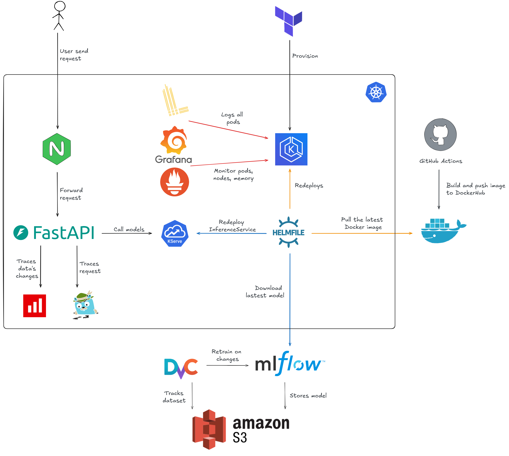

# ML-Ops: Review Sentiment Analysis

A MLOps stack for sentiment analysis using BERT, built on Kubernetes.

## Table of Contents

1. [High Level Architecture](#high-level-architecture)
2. [Project Structure](#project-structure)
3. [Stack](#stack)
4. [Prerequisites](#prerequisites)
5. [Infrastructure - Provision EKS](#1-infrastructure--provision-eks)
6. [Install Cluster Components](#2-install-cluster-components)
7. [Kubernetes Secrets](#3-kubernetes-secrets)
8. [Data - Pull with DVC](#4-data--pull-with-dvc)
9. [Model - Train and Log to MLflow](#5-model--train-and-log-to-mlflow)
10. [CI/CD - GitHub Actions](#6-cicd--github-actions)
11. [Deploy Model](#7-deploy-model)
12. [Testing](#8-testing)
13. [Accessing Services](#9-accessing-services)
14. [Send a Prediction](#10-send-a-prediction)
15. [Destroy Infrastructure](#11-destroy-infrastructure)

---

## High Level Architecture


---

## Project Structure

```
ml-ops/
├── .github/workflows/    # CI/CD pipeline
├── data/                 # DVC-tracked data
├── helm/                 # Helm charts
│   ├── evidently/
│   ├── fastapi-gateway/
│   ├── kserve-model/
│   └── mlflow/
├── infra/eks/            # Terraform (EKS)
├── k8s/                  # Raw Kubernetes manifests
├── requirements/         # Python dependencies
├── scripts/              # Utility scripts (pull_model.py)
├── src/
│   ├── app/              # FastAPI gateway + KServe predictor
│   ├── evidently/        # Drift detection service
│   ├── common/           # Shared utilities
│   ├── train.py          # Model training
│   └── eval.py           # Model evaluation
├── tests/                # Unit + integration tests
└── helmfile.yaml         # Helmfile for all charts
```

---

## Stack

| Component | Technology |
|---|---|
| Model Serving | KServe + Knative (scale-to-zero) |
| Pre/Post Processing | FastAPI + HPA |
| API Gateway | NGINX Ingress + Basic Auth |
| Metrics | Prometheus + Grafana |
| Tracing | Jaeger (OpenTelemetry) |
| Logging | Loki + Promtail |
| Data Drift | Evidently |
| Model Versioning | MLflow |
| Data Versioning | DVC |
| Infrastructure | Terraform (EKS) |
| CI/CD | GitHub Actions |
| Packaging | Helm + Helmfile |

---

## Prerequisites

- AWS account with IAM user (not root) with `AdministratorAccess`
- AWS CLI configured with IAM user (not root):
  ```bash
  aws configure --profile eks-admin
  ```
- Docker
- kubectl
- Helm
- Helmfile v1.3.2+
- Terraform
- Python 3.10+
- DVC with S3 remote

> **Important:** Do not use root credentials. Create an IAM user with `AdministratorAccess` and use those credentials throughout.

---

## 1. Infrastructure — Provision EKS

```bash
cd infra/eks
terraform init
terraform apply
```

Update kubeconfig and grant EKS access:
```bash
aws eks update-kubeconfig --name eks-ap-southeast-1 --region ap-southeast-1 --profile eks-admin

aws eks create-access-entry \
  --cluster-name eks-ap-southeast-1 \
  --principal-arn arn:aws:iam::<account-id>:user/eks-admin \
  --type STANDARD \
  --region ap-southeast-1

aws eks associate-access-policy \
  --cluster-name eks-ap-southeast-1 \
  --principal-arn arn:aws:iam::<account-id>:user/eks-admin \
  --policy-arn arn:aws:eks::aws:cluster-access-policy/AmazonEKSClusterAdminPolicy \
  --access-scope type=cluster \
  --region ap-southeast-1

kubectl get nodes
```

---

## 2. Install Cluster Components

Install in this exact order — each step depends on the previous:

```bash
# 1. cert-manager
kubectl apply -f https://github.com/cert-manager/cert-manager/releases/download/v1.16.0/cert-manager.yaml

# 2. Knative CRDs + core
kubectl apply -f https://github.com/knative/serving/releases/download/knative-v1.16.0/serving-crds.yaml
kubectl apply -f https://github.com/knative/serving/releases/download/knative-v1.16.0/serving-core.yaml

# 3. Kourier (Knative networking)
kubectl apply -f https://github.com/knative-extensions/net-kourier/releases/download/knative-v1.16.0/kourier.yaml

# 4. Configure Knative to use Kourier
kubectl patch configmap/config-network \
  --namespace knative-serving \
  --type merge \
  --patch '{"data":{"ingress-class":"kourier.ingress.knative.dev"}}'

# 5. Enable init-containers (required for KServe storage initializer)
kubectl patch configmap config-features -n knative-serving \
  --type merge \
  -p '{"data":{"kubernetes.podspec-init-containers":"enabled"}}'

# 6. KServe (apply twice — first pass installs CRDs, second installs everything)
kubectl apply --server-side --force-conflicts -f https://github.com/kserve/kserve/releases/latest/download/kserve.yaml
kubectl apply --server-side --force-conflicts -f https://github.com/kserve/kserve/releases/latest/download/kserve.yaml
```

Install all other components with Helmfile:
```bash
helmfile sync
```

> **Note:** cert-manager, KServe, and Knative are installed via `kubectl apply` — they have no official Helm charts. Everything else is managed by Helmfile.

---

## 3. Kubernetes Secrets

```bash
# S3 credentials (default namespace)
kubectl create secret generic s3-credentials \
  --from-literal=AWS_ACCESS_KEY_ID=<your-key> \
  --from-literal=AWS_SECRET_ACCESS_KEY=<your-secret>

# S3 credentials (mlflow namespace)
kubectl create secret generic s3-credentials \
  --from-literal=AWS_ACCESS_KEY_ID=<your-key> \
  --from-literal=AWS_SECRET_ACCESS_KEY=<your-secret> \
  -n mlflow

# Basic auth for NGINX gateway
sudo apt install apache2-utils
htpasswd -c auth admin   # enter your password when prompted
kubectl create secret generic basic-auth --from-file=auth

# Service account for KServe S3 access
kubectl apply -f k8s/serviceaccount.yaml
```

---

## 4. Data — Pull with DVC

```bash
pip install -r requirements/requirements.ml.txt
dvc pull
```

---

## 5. Model — Train and Log to MLflow

Get MLflow public URL:
```bash
kubectl get ingress -n mlflow
# Note the HOST value, e.g. 52.76.209.224.nip.io
```

Train and log model:
```bash
export MLFLOW_TRACKING_URI=http://<mlflow-host>
python src/train.py
```

Model will be registered in MLflow as `review-sentiment-transformer` and artifacts stored in S3.

---

## 6. CI/CD — GitHub Actions

### Required GitHub Secrets (in `ML_OPS_ENVIRONMENTS` environment):

| Secret | Description |
|---|---|
| `AWS_ACCESS_KEY_ID` | IAM user access key (eks-admin, not root) |
| `AWS_SECRET_ACCESS_KEY` | IAM user secret key |
| `DOCKERHUB_USERNAME` | DockerHub username |
| `DOCKERHUB_TOKEN` | DockerHub access token |
| `MLFLOW_TRACKING_URI` | MLflow public URL (e.g. `http://52.76.209.224.nip.io`) |
| `BASIC_AUTH_PASSWORD` | Password for NGINX basic auth |

### Pipeline behavior:

- **Manual trigger** (`workflow_dispatch`) — runs full pipeline: test → build → deploy
- **Test**: runs Pytest with >80% coverage requirement, auto-proceeds to build if passed
- **Build**: pulls model from MLflow on EKS, builds and pushes Docker images to DockerHub
- **Deploy** (manual trigger only): creates secrets, patches Knative config, runs `helmfile sync`

> **Note:** EKS must be running when triggering CI/CD — MLflow lives on EKS.

---

## 7. Deploy Model

The CI/CD deploy job handles this automatically. To deploy manually:

```bash
kubectl patch configmap config-features -n knative-serving \
  --type merge \
  -p '{"data":{"kubernetes.podspec-init-containers":"enabled"}}'

kubectl patch configmap config-network -n knative-serving \
  --type merge \
  -p '{"data":{"ingress-class":"kourier.ingress.knative.dev"}}'

helm install kserve-model helm/kserve-model
kubectl get inferenceservice --watch
```

---

## 8. Testing

### Unit tests (no cluster required):
```bash
pip install pytest pytest-cov
pip install -r requirements/requirements.gateway.txt
pytest tests/test_gateway.py --cov=gateway --cov-fail-under=80
```

### Integration tests (requires running cluster):
```bash
kubectl port-forward svc/ingress-nginx-controller 8080:80 -n ingress-nginx
pytest tests/test_integration.py -v
```

---

## 9. Accessing Services

| Service | Command | URL |
|---|---|---|
| Grafana | `kubectl port-forward svc/prometheus-grafana 3000:80 -n monitoring` | http://localhost:3000 |
| Jaeger | `kubectl port-forward svc/jaeger-query 16686:16686 -n monitoring` | http://localhost:16686 |
| MLflow | Public via ingress | `http://<mlflow-host>` |
| Evidently | `kubectl port-forward svc/evidently 8001:8001` | http://localhost:8001 |
| Gateway | `kubectl port-forward svc/ingress-nginx-controller 8080:80 -n ingress-nginx` | http://localhost:8080 |

### Grafana credentials:
```bash
kubectl --namespace monitoring get secrets prometheus-grafana \
  -o jsonpath="{.data.admin-password}" | base64 -d
```

---

## 10. Send a Prediction

```bash
# Port-forward NGINX ingress
kubectl port-forward svc/ingress-nginx-controller 8080:80 -n ingress-nginx

# Send prediction
curl -u admin:<password> \
  -H "Host: gateway.local" \
  -X POST http://localhost:8080/predict \
  -H "Content-Type: application/json" \
  -d '{"text": "this movie was great"}'
```

Response:
```json
{"label": "POSITIVE", "confidence": 0.98}
```

### Test data drift (Evidently):
```bash
kubectl port-forward svc/evidently 8001:8001

# Log 10+ predictions first
for i in {1..10}; do
  curl -X POST http://localhost:8001/log \
    -H "Content-Type: application/json" \
    -d '{"review": "this movie is great"}'
done

# Check drift report
curl http://localhost:8001/drift
```

---

## 11. Destroy Infrastructure

```bash
cd infra/eks
terraform destroy
```

> Remember to destroy the cluster after use to avoid ongoing AWS costs.
